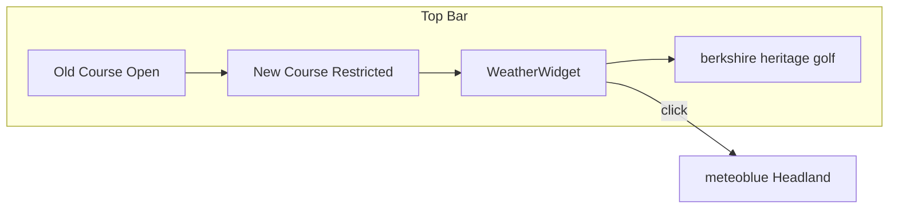

# Widget de Clima para el Top Bar de Billingbear Park

## Contexto

- **Top bar actual**: Solo existe en [src/pages/index.astro](src/pages/index.astro) (líneas 53-91), con status de Old/New Course a la izquierda y "berkshire heritage golf" a la derecha
- **Páginas internas** (contact, events, history, vouchers): Usan un nav distinto sin top bar
- **URL meteoblue actual**: [https://www.meteoblue.com/en/customer/headland/index?id=1000452](https://www.meteoblue.com/en/customer/headland/index?id=1000452) (Billingbear Park Golf Course)
- **Coordenadas**: 51.44°N, 0.82°W (Wokingham, Berkshire)

## Opciones de Implementación

### Opción A: Widget custom con Open-Meteo API (recomendada)

**Ventajas**: Gratuita, sin API key, datos en tiempo real, control total del diseño.

- API: `https://api.open-meteo.com/v1/forecast?latitude=51.44&longitude=-0.82&current=temperature_2m,weather_code`
- Respuesta JSON: `temperature_2m`, `weather_code` (WMO codes)
- Fetch **client-side** (no en build) para datos siempre actuales

**Implementación**:

1. Crear componente React `WeatherWidget.tsx` en `src/components/`:

- Fetch a Open-Meteo en `useEffect` (o `onMount` si usas Astro)
  - Mapeo de `weather_code` a icono SVG/emoji y descripción breve
  - Render compacto: icono + temperatura (ej: "9°C nublado")
  - Enlace a meteoblue con `target="_blank"` y `rel="noopener"`

1. Integrar en el top bar de index.astro:

- Ubicación: entre los status de cursos y "berkshire heritage golf"
  - Estilo: `border-l border-white/10 pl-6` para separación visual
  - Fallback: skeleton o "—°C" mientras carga

1. Incluir también en el nav sticky (cuando se activa el modo compacto) si hay espacio, o como elemento opcional en viewports grandes.

### Opción B: iframe de meteoblue

**Requisito**: Cuenta meteoblue (el configurador indica "You need a meteoblue account to embed").

- Configurador Daily Widget: [https://www.meteoblue.com/en/weather/widget/setupday](https://www.meteoblue.com/en/weather/widget/setupday)
- Ubicación: Wokingham, UK (51.44, -0.82)
- El iframe generado suele ser ancho (~300px) — puede ser demasiado para el top bar
- Alternativa: iframe muy estrecho mostrando solo 1-2 días, con scroll horizontal

**Limitación**: Los widgets estándar de meteoblue no apuntan directamente a la página Headland (id=1000452); sería un widget genérico para la zona. El enlace a Headland se mantendría como destino del "Ver más".

### Opción C: Solo enlace con preview estático

Mínimo viable: texto "Weather" o icono termómetro + link a meteoblue, sin datos en vivo. Simple pero menos informativo.

---

## Recomendación: Opción A

Flujo propuesto:

**Estructura del WeatherWidget**:

- **Desktop**: `[icono] 9°C · Overcast — Ver pronóstico →`
- **Mobile**: `[icono] 9°C` (tap abre meteoblue)

**Archivos a crear/modificar**:

| Archivo                            | Acción                                        |
| ---------------------------------- | --------------------------------------------- |
| `src/components/WeatherWidget.tsx` | Crear componente React con fetch a Open-Meteo |
| `src/pages/index.astro`            | Importar WeatherWidget e insertar en top bar  |

**Mapeo weather_code (WMO)** para iconos/etiquetas:

- 0: Clear — soleado
- 1-3: Mainly clear / Partly cloudy / Overcast
- 45,48: Fog
- 51-67: Drizzle/Rain
- 71-77: Snow
- 80-99: Showers/Thunderstorms

---

## Consideraciones

1. **CORS**: Open-Meteo permite requests desde cualquier origen; no requiere proxy
2. **Rate limit**: Open-Meteo es permisivo para uso básico; cachear 10-15 min en el cliente si se desea
3. **Accesibilidad**: `aria-label` en el enlace, texto alternativo para el icono
4. **Fallback**: Si el fetch falla, mostrar solo el enlace "Weather forecast" sin temperatura
5. **Consistencia**: Si más adelante se quiere el widget en otras páginas, extraer el top bar a un componente compartido
